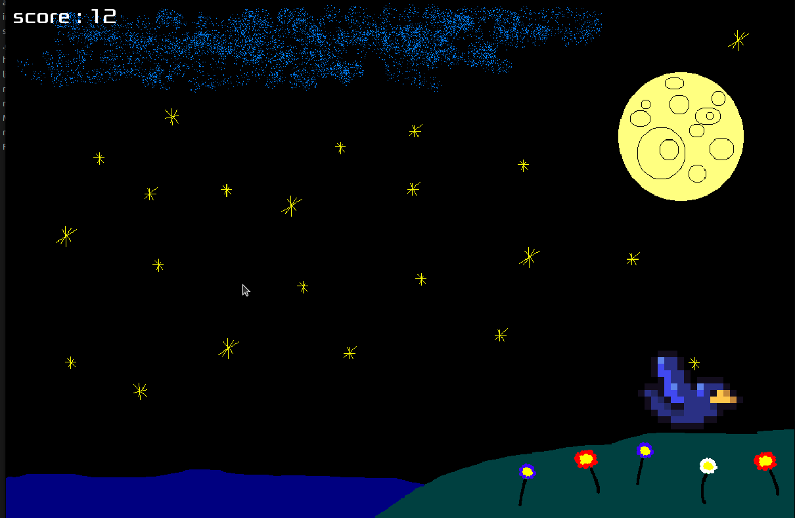

# my_hunter
an attempt at reproduction of the classic 1984 duck_hunt in c using the csfml library.

if you don't have the sfml library installed, it will not work.

## HOW TO INSTALL CSFML/SFML

### on Ubuntu:

sudo apt install libcsfml-graphics2.5 libcsfml-audio2.5 libcsfml-dev libcsfml-doc libcsfml-network2.5 libcsfml-system2.5 libcsfml-window2.5

or

sudo apt install libcsfml-*

### on MacOs

brew install csfml

## HOW TO PLAY

run the following command in the terminal to compile the program -> make

run the following command in the terminal to play -> ./my_hunter

